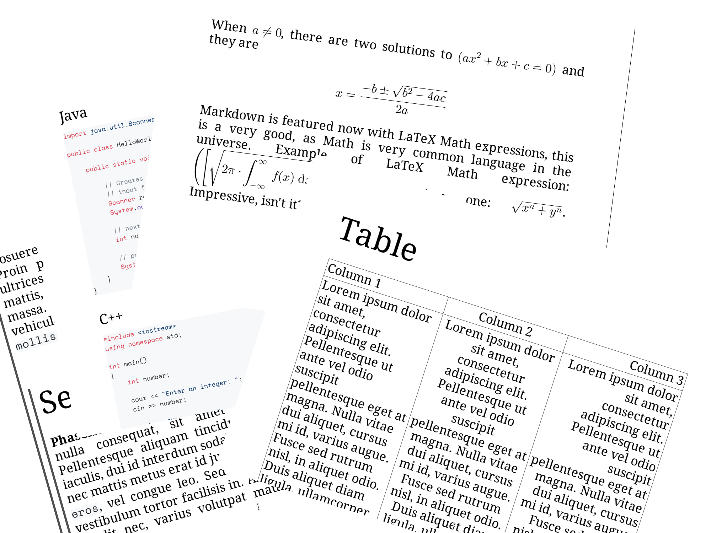

# About

This is a static C++ library for converting Markdown into PDF.

You can play with this library in [Markdown Tools](https://github.com/igormironchik/markdown-tools).

# License

```
/*
    SPDX-FileCopyrightText: 2026 Igor Mironchik <igor.mironchik@gmail.com>
    SPDX-License-Identifier: GPL-3.0-or-later
*/
```

This project forced to be under the GPL license because I use code from Qt 6. I use only
one function from Qt 6, so it's not so big deal to write that function by myself and
free from GPL ties. If somebody wants something like the MIT license - you are
welcome to discuss it with me.

# Screenshots


